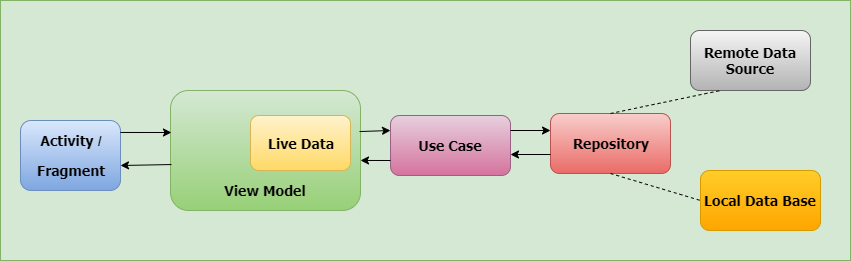

# Qwez
Get the app under releases to the right :point_right:

## What is Qwez?
Qwez is a questionare app! Here's the features & what you can do within the app:
- Create an account
- Log in and log out
- Change user password, email, and profile photo.
- Choose a category & difficulty and get 10 questions. You can now answer these to score points! But hurry up, there is a timer.
- See a global highscore of all users (incl. your own). You can see how you compare to other players.
- The app uses Firebase for user authenticaion, storage (user profile photos) and maintaining highscores. When you create an account, log in, log out or delete an account it is all taken care of by Firebase. Photos are uploaded to Firebase storage, and access from there.

## Modernisation
This App is currently going through a modernisation process to change outdated components to modern, while still being written in Java (Mostly). Here is a TODO list of changes:
- :white_check_mark: Migrate to Kotlin DSL and library version catalog
- :white_square_button: Migrate from Butterknife to Viewbinding
- :white_square_button: Migrate from RxPermissions to AndroidX ActivityResult API
- :white_square_button: Modularize the application
- :white_square_button: Migrate from RxBus
- :white_square_button: Redesign the UI elements
- :white_square_button: Migrate to Hilt
- :white_square_button: Migrate to Datastore

## OBS OBS OBS!!
- Please beware that Interactors (=Use cases) does perform a bit of "server-side" code!! This is because not having access to some of the paid-for features from Firebase (function triggers, etc). I did have to put some of the server side code in
the interactors/usecases, solely for having the app work to try out some new things without paying for Firebase. This all was just for fun and learning!! Of course this code would never have a place in a commersial product.

## Architecture:

- MVVM: Model-View-Viewmodel
- Repository: One repository per data type e.g sharedpreferences repository, Firebase repository etc
- Uses a [RxJava Bus](https://github.com/aliamid93/Qwez/tree/master/app/src/main/java/com/example/qwez/bus) for communication between different parts of the application.
- Interactor's (Aka Use-cases): Single responsibility interactor classes for interacting with repository/repositories, services, etc. This is where the applications "business logic" resides.
- App is highly extensible. It can easily be modified and added with further behaviour. To add new "UI package", one must:
    - Create Activity (And/or Fragment(s))
    - Create Activity Module (For dependency injection), add module to Dagger Application Component
    - Bind module to activity in "di" package
    - Create Viewmodel
    - Create Viewmodel factory
    - Provide all dependencies via Module, provide dependencies in parameters to factory+viewmodel
    
# Following libraries are using in this app:

## Design
- [Dagger2](https://google.github.io/dagger/) for dependency injection.
- [RxJava](https://github.com/ReactiveX/RxJava) for composing asynchronous and event-based programs (Observer-Observable pattern).
- [RxAndroid](https://github.com/ReactiveX/RxAndroid) for added RxJava classes/functionality for Android.
- [Butterknife](http://jakewharton.github.io/butterknife/) for view binding.
- [Glide](https://github.com/bumptech/glide) for image loading.
## Data
- Firebase:
    - [Firestore](https://firebase.google.com/docs/firestore) for online database.
    - [Firebase Auth](https://firebase.google.com/docs/auth) for user authorization.
- [Room](https://developer.android.com/topic/libraries/architecture/room) for local database.
## UI
- [Material Design](https://material.io/develop/android/docs/getting-started/) for helping creating UI in coordinance with Google's
Material Design guidelines.
- [Material Dialogs](https://github.com/afollestad/material-dialogs) for creating dialogs.
- [Lottie](https://github.com/airbnb/lottie-android) for animations.
## Networking
- [Retrofit](https://square.github.io/retrofit/) (+[okhttp for interceptor](https://square.github.io/okhttp/3.x/logging-interceptor/okhttp3/logging/HttpLoggingInterceptor.Level.html)) for API calls.
## Testing
- [Mocktio](https://site.mockito.org/) for testing. Very powerful testing library.
## Logging/Debugging
- [Leak Canary](https://github.com/square/leakcanary) for detecting any memory leaks.
- [Timber](https://github.com/JakeWharton/timber) for simplified logging.
- [Stetho](https://github.com/facebook/stetho) for debugging of network/local database.
## Others
- Standard libraries: AppCompat, JUnit, Espresso, CardView, RecyclerView, support libraries,Apache Commons Text...

# Wrappers
Application have some RxJava wrappers for different parts of the application, to ease reactive programming within the app:
- [SharedPreferences](https://github.com/aliamid93/Qwez/tree/master/app/src/main/java/com/example/qwez/repository/sharedpref)
- [Firebase](https://github.com/aliamid93/Qwez/tree/master/app/src/main/java/com/example/qwez/repository/firebase/rxwrapper)

# License

    MIT License

    Copyright 2019 AliAmid93

    Permission is hereby granted, free of charge, to any person obtaining a 
    copy of this software and associated documentation files (the "Software"),
    to deal in the Software without restriction, including without limitation 
    the rights to use, copy, modify, merge, publish, distribute, sublicense, 
    and/or sell copies of the Software, and to permit persons to whom the 
    Software is furnished to do so, subject to the following conditions:

    The above copyright notice and this permission notice shall be included 
    in all copies or substantial portions of the Software.

    THE SOFTWARE IS PROVIDED "AS IS", WITHOUT WARRANTY OF ANY KIND, EXPRESS 
    OR IMPLIED, INCLUDING BUT NOT LIMITED TO THE WARRANTIES OF MERCHANTABILITY,
    FITNESS FOR A PARTICULAR PURPOSE AND NONINFRINGEMENT. IN NO EVENT SHALL THE
    AUTHORS OR COPYRIGHT HOLDERS BE LIABLE FOR ANY CLAIM, DAMAGES OR OTHER LIABILITY,
    WHETHER IN AN ACTION OF CONTRACT, TORT OR OTHERWISE, ARISING FROM, OUT OF OR
    IN CONNECTION WITH THE SOFTWARE OR THE USE OR OTHER DEALINGS IN THE SOFTWARE.
